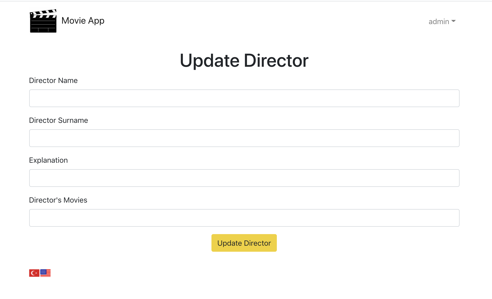

# Movie-App-with-Spring-Boot-and-React
Gereksinimler:
--
* JDK 11 kurulu olmalı : http://jdk.java.net/java-se-ri/11 (OpenJDK) İşletim sistemininize uygun indirme bağlantısını kullanarak bilgisayarınıza JDK 11 kurunuz. Ayrıca terminalden jar dosyası çalıştırılmak istenirse ortam değişkeni (PATH) ayarlanmış olmalı.

* Derleme için Maven kurulu olmalıdır. 

    İndirme Bağlantısı: https://maven.apache.org/download.cgi
    
    https://maven.apache.org/install.html adresinden kurulum adımlarını inceleyebilirsiniz. 

    Maven ortam değişkenlerinde (PATH) kayıtlı olmalıdır. 
    Bkz: Path ayarlama
  
---

* Kurulumlardan sonra:

    Terminal üzerinde: 

        git clone https://github.com/furkaninch/Movie-App-with-Spring-Boot-and-React.git
    (Git Kurulu olmalıdır bu komut için)

    İlgili Klasöre giriniz ve react dosyasini acarak oncelikle gerekli dosyalari

        cd movie-app-react
        npm install
    komutlari ile indiriniz kurulum tamamlandiktan sonra 

        npm start
    komutu ile uygulamayi baslatiniz

    Sonrasinda IDE uzerinde 
    
        movie-spring

     klasorunu acarak server'i baslatiniz. 

    React uzerinde proxy icin 8080 portu kullanilmistir tum API requestler bu porta gitmektedir lutfen serverin bu portta calistigindan emin olunuz.

    Uygulama uzerinde degisiklikler yapmak icin login olmaniz gerekir login icin asagidaki kullanici adi ve sifreyi kullanabilirsiniz.
        
        username: admin
        password: P4ssword

    
---
---        

Uygulama özellikleri:
--
* Tum sayfalar react i18next kullanilarak Ingilizce ve Turkce dil destegine sahip hale getirilmistir.

* Ayrica server'a atilan requestler valid degilse donulen 'API ERROR' cevaplari da ingilizce ve turkce olarak donmektedir.

* Ana sayfada Directors, Movies ve Studios olmak uzere uc adet card bulunmaktadir. Ilgili butona tiklayarak ilgili listeye erisilebilir.

* Eger kullanici login olmamis ise bu listeleri sadece goruntuleyebilir silme ve guncelleme islemlerinde bulunamaz.

* Ayni sekilde kullanicinin link uzerinden bu guncelleme ve silme islemlerinde bulunmasida React Router ile engellenmis ve sadece kullanici giris yapmis ise bu baglantilari acabilir hale gelmistir. 

* Bu listeler sayfa seklindedir ve assagida bulunan sonraki ve onceki butonlari sayesinde sayfalar degistirilebilir. Ilk sayfada onceki son sayfada sonraki butonu de-aktive olur.

* Kullanicinin login olup olmamasi durumu react redux ile tutulur ve sayfalar arasinda birbirine paslanir.

* Kullanici girisi, yeni bir ekleme ya da guncelleme durumunda network'un yavas oldugu durum goz onune alinarak pes pese birden fazla request atilmamasi icin butonlar ilk requeste cevap gelene kadar disable olur ve spinner yardimi ile kullaniciya islemin surdugu bilgisi verilir.

* Yeni bir liste elemani eklenirken basarili durumda kullaniciya bununla ilgili bir success alert gosterilir kullanici yeni bir input girene kadar bu alert sayfada kalir yeni bir input girilir ise bu alert sayfadan kaldirilir.

---
Kod standartlarına uygun yazılım geliştirilmiştir:

* OOP odaklı Katmanlı mimari kullanılmıştır. 

        Data erişim katmanı 
        Servis Katmanı
        Sunum Katmanı
        Interface'ler kullanılmıştır.

---

Kullanılan Teknoloji & Yazılımlar
--
Spring Boot, Spring Security, JPA-Hibernate, Maven, HTML, CSS, JS, React.js, Axios, Bootstrap, Lombok, Redux, Hooks, react-i18next, React-Router

---

NOTLAR
--
Bazı IDE'lerde lombok plugini problem çıkarmaktadır. Getter ve setter gibi metodlar görünmezse bu problem var demektir. İlgili IDE'ye lombok plugini yüklenmeli.

---
Proje Ekran Goruntuleri
---
* Ana Sayfa(Ingilizce)

* Ana Sayfa(Turkce)

* Giris Sayfasi

* Kullanici Girisi Olmadan Liste

* Kullanici Girisi Sonrasi Liste (Guncelleme ve Silme Butonlari Aktif)

* Listeye Eleman Ekleme Sirasinda Validation Mesaji (Ingilizce)

* Listeye Eleman Ekleme Sirasinda Validation Mesaji (Turkce)

* Listeye Eleman Basariyla Eklendi Mesaji

* Guncelleme Sayfasi

* Networkun yavas olmasi halinde ilk request sonrasi butonun disable oldugu ve spinner ile kullanicinin bilgilendirildigi durum.

